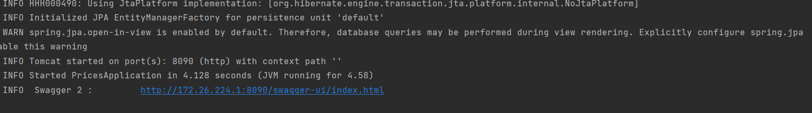
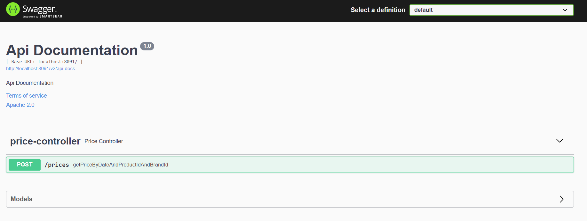

# Prices spring boot api 

Prices spring boot api permite a partir de una fecha, la marca y el identificador del producto determinar el precio en
stock segun el rango de fechas y prioridad determinados para el producto.

## Tecnologias

- Spring boot, como framework base de desarollo.
- Maven como gestor de paquetes.
- H2, como motor de base de datos.
- Swagger, para documentar y manipular los servicios expuestos.
- Docker, como servicio de empaquetado de contenedores.

## Estructura

- application: todo lo que se consume externamente y dtos.
- application: todos los casos de uso.
- domain: mapeo de entidades y acceso a datos.
- data.sql: contiene insert inicial para pruebas.
- test: pruebas unitarias para capas.

## Dockerizando 

# Generar los artefactos en el paquete target:

.\mvnw.cmd clean package install

# Generar imagen de docker y dejarla en un container:

  docker build -t inditex/prices-api .

# Ejecutar contenedor:

  docker run -d  --name prices-api  --net bridge  -p 8091:8091  inditex/prices-api

Una vez se este ejecutado el servicio se debe visualizar la url de swagger en el log:

